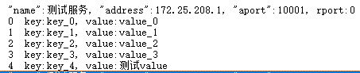

# mDNS_Windows
Using mdns to realize self-discovery service and client under Windows.

# Two ways to install the mDNS environment
## 1. Install Apple Bonjour service
Download Bonjour.msi / Bonjour64.msi
## 2. Compile mDNSResponder by yourself
If you don't want to install the Apple Bonjour service, 
download the mDNSResponder service to compile and integrate it into your own program.

# The search results are as follows

